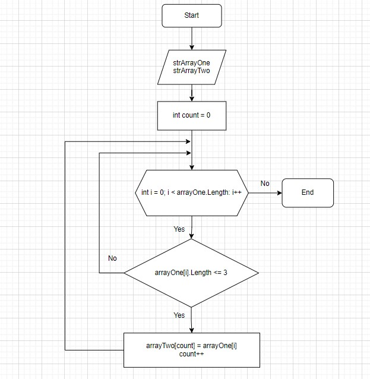

Написать программу, которая из имеющегося массива строк формирует массив из строк, длина которых меньше либо равна 3 символа. Первоначальный массив можно ввести с клавиатуры, либо задать на старте выполнения алгоритма. При решении не рекомендуется пользоваться коллекциями, лучше обойтись исключительно массивами.

В папке вы найдете блок схему которая описывает непосредственно метод сортирующий массив.
Алгоритм программы:

Объявляем два массива:

Первый массив будет начальным, второму задаем длину первого. Затем создаем метод для сортировки массива удовлетворяющим условиям задачи. В методе создаем переменную счетчик. Затем в методе создаем цикл, а в цикле проверку условия меньше или равно трем. Если условие true то элемент первого массива сохраняется в счетчике элемента второго массива. После сохранения элемента переменная-счетчик увеличивается на единицу и возвращается в цикл, переменная-условие цикла увеличивается на единицу и проверка идет дальше пока условие выполняется.
